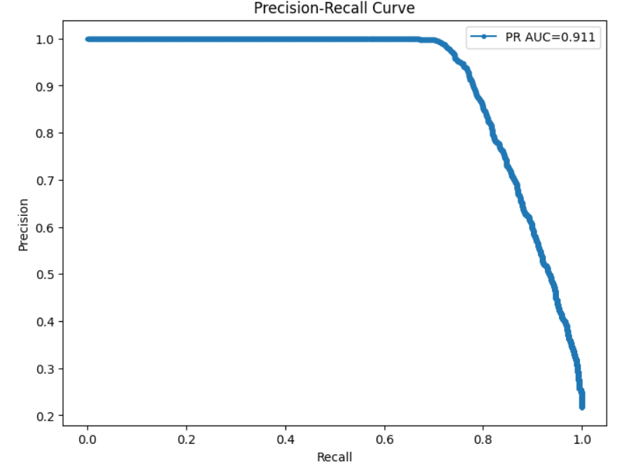

# Credit Scoring Project ⚡️

📊 **Описание**  
Проект реализует систему кредитного скоринга для оценки вероятности дефолта клиентов. Используется машинное обучение для предсказания риска невозврата кредита.  

**Метрики модели:**  
- Recall = 0.75  
- Precision = 0.96  

Эти показатели позволяют эффективно идентифицировать проблемных заемщиков и минимизировать ложные срабатывания.

---

## 📂 Структура проекта

Credit_scoring/
├─ 📁 backend/ 
│ ├─ src/ 
│ ├─ service.py 
│ └─ requirements.txt 
├─ 📁 frontend/ 
│ ├─ app.py 
│ └─ requirements.txt
├─ 📁 data/
│ └─ raw/ 
├─ 📁 model_training/ модели
│ ├─ data_preprocessing.py
│ ├─ train_model.py
│ └─ utils.py
├─ 🐳 Dockerfile.backend 
├─ 🐳 Dockerfile.frontend 
├─ 🐳 docker-compose.yml 
└─ 📄 README.md 

---


### 🔹 Пояснения
- **backend/** – API, которое принимает данные клиента и возвращает прогноз вероятности дефолта.  
- **frontend/** – удобный интерфейс для ввода данных и отображения прогнозов.  
- **data/raw/** – исходные данные, на которых обучалась модель.  
- **model_training/** – скрипты подготовки данных, обучения модели и сохранения результатов.  
- **Dockerfile** и **docker-compose.yml** – для быстрого развертывания проекта локально или на сервере.  

---

## 🔧 Требования

- Python 3.10+  
- Docker и Docker Compose  
- Основные библиотеки Python: `pandas`, `scikit-learn`, `numpy`, `matplotlib`, `seaborn`, `fastapi`/`flask` (можно установить при запуске приложения)  

---

## 🚀 Установка и запуск

### 1️⃣ Клонирование репозитория
```bash
git clone https://github.com/lakum48/Credit_scoring.git
cd Credit_scoring
```
### 2️⃣ Запуск через Docker Compose
```bash
docker-compose up --build
```
### 3️⃣ Локальный запуск (без Docker)
#### Backend:
```bash
Копировать код
cd backend
pip install -r requirements.txt
cd src
uvicorn service:app
```
#### Frontend:
```bash
Копировать код
cd frontend
pip install -r requirements.txt
streamlit run app.py
```
### 📊 Метрики и визуализация
####  Recall: 0.75
#### Precision: 0.96

#### Precision-recall curve:



